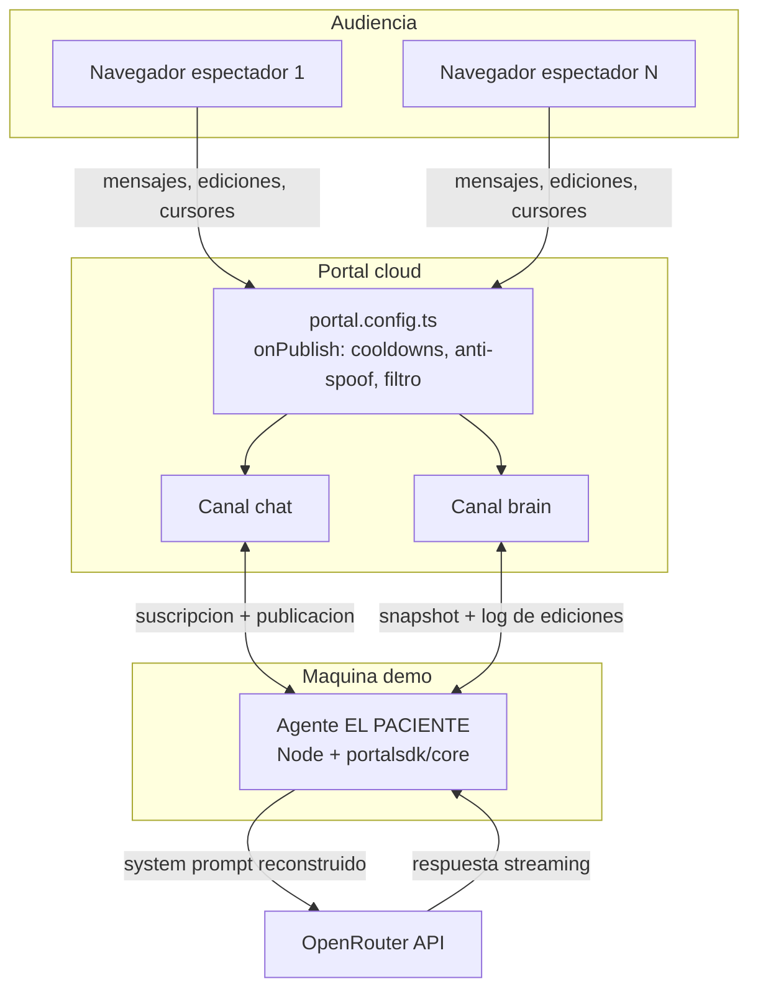

# Arquitectura técnica

Documento vivo. Actualizar cada vez que cambie el stack, la estructura de carpetas
o cualquier decisión técnica relevante. Los cambios se registran también en `changelog/`.

---

## Stack seleccionado

| Capa | Tecnología | Justificación |
|------|-----------|---------------|
| Frontend | React 19 + Vite + TypeScript | Portal publica bindings oficiales para React (`@portalsdk/react`); Vite es el camino más corto a una SPA |
| Realtime / estado | **Portal** (`@portalsdk/react`, `@portalsdk/core`, `portal.config.ts`) | Requisito del hackathon y encaja exacto: canales con historial, presencia, typing, mensajes ephemeral y middleware server-side |
| IA | **OpenRouter** (modelo por defecto: `anthropic/claude-haiku-4.5`) | Un endpoint, muchos modelos: rápido y con personalidad para sentirse "en directo"; cambiable por env sin tocar código |
| Agente | Proceso Node 22+ con `@portalsdk/core` | Portal no documenta API REST de publicación server-side → la IA se conecta como un cliente más, con identidad propia |
| Estilos | CSS plano + estilos inline tipados | El diseño llegó de Claude Design como estilos inline; portarlo a Tailwind era trabajo perdido. Los tokens viven en `theme.ts` y las animaciones en `styles.css` |
| Base de datos | Ninguna | El estado ES los canales de Portal (historial incluido). Ver `data-model.md` |
| Despliegue | Vercel (frontend) + agente en contenedor (Railway/Fly) o local | La web es estática; el agente es un proceso de larga duración con WebSocket, y eso no cabe en Vercel |

---

## Diagrama de componentes



Flujo clave: una edición del cerebro pasa por el middleware (¿cooldown ok? ¿usuario ok?),
se publica en `brain`, todos los clientes la ven al instante, y el agente — suscrito al
mismo canal — reconstruye su system prompt y decide si reacciona.

---

## Estructura de carpetas

Monorepo pnpm workspaces:

```
el-paciente/
├── apps/
│   ├── web/                  → SPA React (Vite)
│   │   ├── index.html        → La aplicación real
│   │   ├── preview.html      → Previsualización de UI con datos fijos, sin Portal
│   │   └── src/
│   │       ├── components/   → Monitor, ChatPane, BrainPane, BrainSlot, EditLog, Toast
│   │       ├── hooks/        → useBrain, useChat, useAiReveal, useNow
│   │       ├── lib/          → cliente Portal, adaptador de mensajes, identidad
│   │       └── theme.ts      → Tokens del diseño
│   └── agent/                → Agente EL PACIENTE (Node 22+, TS nativo)
│       └── src/
│           ├── portal-client.ts → Cliente Portal y firma de mensajes
│           ├── prompt.ts        → System prompt (capa fija + regiones + historial)
│           ├── llm.ts           → Cliente OpenRouter con modelo de respaldo
│           └── index.ts         → Bucle: disparadores, coalescencia, turnos
├── packages/
│   └── shared/               → Tipos, reducer del cerebro, seed, colores, cooldowns
├── portal.config.ts          → Config server-side de Portal (canales, middleware)
└── docs/ · changelog/ · mejoras/
```

---

## Estrategia de autenticación

**Todo el mundo es anónimo**, incluida la IA — no hay login (decisión de producto).

- Espectadores: modo anónimo de Portal (`me.anon === true`). El nickname y el color viajan
  como metadata de presencia y dentro del contenido de cada mensaje.
- **Anti-spoofing de la IA:** los mensajes con `role: "ai"` solo son válidos si llevan un
  campo `secret` que coincide con `env("AGENT_SECRET")`. El middleware `onPublish` de
  `portal.config.ts` los verifica: si el secreto no coincide → `block`; si coincide →
  `mask` con el mismo contenido sin el campo `secret` (así el secreto nunca llega a los
  clientes). Ningún navegador puede hacerse pasar por EL PACIENTE.
- Cooldowns por usuario usando `ctx.sender.id` (la credencial anónima persiste por cliente).

---

## Integraciones externas

- **Portal** — toda la capa realtime. Canales `chat` y `brain` (ver `data-model.md`).
  El middleware server-side vive en `portal.config.ts` y se despliega con la CLI de Portal.
- **OpenRouter** — inferencia del modelo. Solo el agente tiene la clave
  (`OPENROUTER_API_KEY`); el navegador jamás habla con OpenRouter. Modelo configurable
  con `OPENROUTER_MODEL` (por defecto `anthropic/claude-haiku-4.5`) y fallback
  `OPENROUTER_MODEL_FALLBACK`.

---

## MCPs del proyecto

Ninguno configurado a nivel de proyecto (`claude mcp list` → vacío, 2026-08-08).

| Servidor | Alcance | Para qué se usa | Variables necesarias |
|----------|---------|-----------------|----------------------|
| vercel | user (app de escritorio) | Deploy y logs del frontend | — (OAuth) |

Revisado el 2026-08-08: **Portal no publica servidor MCP oficial** (no aparece en
docs.useportal.co) y OpenRouter tampoco es necesario como MCP — el agente habla con su API
directamente. Si más adelante Portal publica uno, seguir el "Protocolo de MCPs" de
`CLAUDE.md` antes de instalarlo.

---

## Estrategia de despliegue

Repositorio: <https://github.com/polmarza/el-paciente> (público, `origin`, rama `main`).

- **Frontend:** Vercel, deploy desde `main` (`apps/web`). Variables `VITE_*` en el panel.
  Es PWA instalable (`public/manifest.webmanifest` + iconos), **sin service worker a
  propósito**: Chrome ya no lo exige para instalar, el juego es realtime (el offline no
  significa nada) y un SW cacheando bundles nos daría clientes con código viejo — ya
  sufrimos una vez el equivalente con la caché normal del navegador.
- **Config de Portal:** `portal.config.ts` se despliega con `@portalsdk/cli`. El CLI no
  tiene login interactivo: se autentica con la secret key del proyecto en el entorno.
  El deploy es atómico (si hay errores, no se aplica nada).

  ```bash
  export PORTAL_SECRET=sk_...        # secret key del proyecto (vive en .env.local)
  npx @portalsdk/cli deploy          # despliega portal.config.ts del directorio actual
  npx @portalsdk/cli secrets set AGENT_SECRET   # secretos que el middleware lee con env()
  ```

  Los secretos que usa el middleware (`AGENT_SECRET`) se registran con `secrets set`: su
  valor se resuelve en ejecución y nunca se escribe en la configuración.
- **Agente:** dos modos, mismo código.
  - *Demo local:* `pnpm agent` en la máquina anfitriona. Un proceso que ves en tu terminal
    es lo más fiable durante una presentación.
  - *24/7:* el `Dockerfile` de la raíz empaqueta SOLO el agente (la web va en Vercel) para
    correrlo como worker en Railway/Fly/Render. No expone puertos — el agente solo abre
    conexiones salientes — y debe fijarse a **una réplica**: el cerrojo de instancia única
    es un PID local, no distribuido, y dos agentes responden por duplicado. Las variables
    (`PORTAL_API_KEY`, `AGENT_SECRET`, `OPENROUTER_*`) van en el panel de la plataforma.
    Los reinicios son seguros: el arranque espera al `ready` del canal **y** a que el
    backfill esté volcado en el almacén antes de decidir si la sala está virgen — Portal
    emite `ready` un instante antes de rellenar `channel.messages`, y leer en ese hueco
    hacía que el agente sembrara una ronda encima de la partida en curso.
- Entornos: solo `dev` (local) y `demo` (Vercel + agente donde toque). No hay staging.

---

## Decisiones técnicas relevantes

### 2026-08-08 — La IA es un cliente Portal, no un backend con API

**Contexto:** el agente tiene que escuchar los dos canales y además hablar.
**Opciones:** (a) agente como cliente Portal en Node; (b) publicar desde el middleware
`onPublish`; (c) que el navegador del host ejecute la IA.
**Decisión:** (a). El middleware no está pensado para originar mensajes y (c) pone la clave
de OpenRouter en un navegador.
**Corrección (verificada el 2026-08-08):** una versión anterior de esta decisión afirmaba
que "Portal no expone una API REST para publicar desde un servidor". **Es falso**: existe
`POST https://api.useportal.co/v1/channels/{channelId}/messages`, autenticada con
`Authorization: Bearer <sk_>` y con `senderId` en el cuerpo. Se usó para la prueba de humo
de esta sesión. La decisión (a) sigue siendo la correcta igualmente, porque escuchar exige
el WebSocket de todas formas y el agente ya lo tiene abierto — pero abre una simplificación
posible del anti-suplantación, anotada en `mejoras/backlog.md`.
**Consecuencias:** el agente necesita un proceso corriendo durante la demo.

### 2026-08-08 — Estado = canales de Portal, sin base de datos

**Contexto:** el cerebro necesita estado compartido con log de autoría.
**Decisión:** el canal `brain` es la fuente de verdad; el estado actual se deriva por
reducción (last-write-per-slot) y el historial del canal ES el log de ediciones que ve la IA.
**Consecuencias:** cero infra de datos; la persistencia depende de la retención de historial
de Portal (suficiente para una demo; el cerebro semilla se puede re-publicar con el reset).

### 2026-08-08 — Cooldowns en middleware, no en UI

**Contexto:** el caos es deseable pero debe ser gobernable; la UI es falsificable.
**Decisión:** `onPublish` en `portal.config.ts` rechaza ediciones que violen cooldown por
región o por usuario. El motivo viaja en `BlockedError.reason` — texto que Portal define
explícitamente como visible para el usuario final — y la UI lo muestra tal cual en un toast.
**Consecuencia y límite conocido:** Portal no documenta almacenamiento persistente para el
middleware, así que el registro de tiempos vive en memoria del proceso que ejecuta los
callbacks. Si Portal repartiera las invocaciones entre varias instancias, algún cooldown se
colaría. Las reglas que sí son de seguridad (el secreto del agente y los límites de
longitud) no dependen de ningún estado.
**Verificado en vivo el 2026-08-08** contra el despliegue real: el cooldown de región
bloquea la segunda edición seguida con su motivo legible, y las nueve comprobaciones de la
sonda de middleware (suplantación de la IA sin secreto y con secreto falso, `system` y
`seed` falsificados, exceso de longitud, región inexistente, uso legítimo y cooldown)
dieron el resultado esperado.

### 2026-08-08 — La IA no transmite carácter a carácter

**Contexto:** el diseño muestra a EL PACIENTE tecleando en vivo.
**Opciones:** (a) el agente publica un mensaje por fragmento; (b) publica la frase entera y
el navegador la revela tecleando.
**Decisión:** (b), en `useAiReveal`. Un mensaje por fragmento multiplicaría por cincuenta el
tráfico del canal y el coste, para un efecto que el cliente reproduce igual. Solo se anima
lo que llega después de montar: el historial de backfill aparece completo.

### 2026-08-08 — El contrato de Portal se leyó de sus tipos, no de la documentación

**Contexto:** la documentación pública de Portal no fija el nombre del campo de fecha de un
mensaje ni la forma de `PortalProvider`.
**Decisión:** las suposiciones se sustituyeron por lo que declaran los `.d.ts` de
`@portalsdk/core@0.1.5`. Hechos verificados que el código da por ciertos:
`Message.timestamp` (epoch ms), `Message.ephemeral` / `.retracted` / `.sender.id`,
`PortalProvider` recibe `client` (no `apiKey`), `presence.count` existe en las dos formas de
presencia, `typing` devuelve **ids de usuario** (por eso el nickname viaja en la metadata de
presencia) y `BlockedError.reason` es copia visible para el usuario.
**Consecuencia:** si se sube de versión mayor el SDK, revisar esos puntos.
