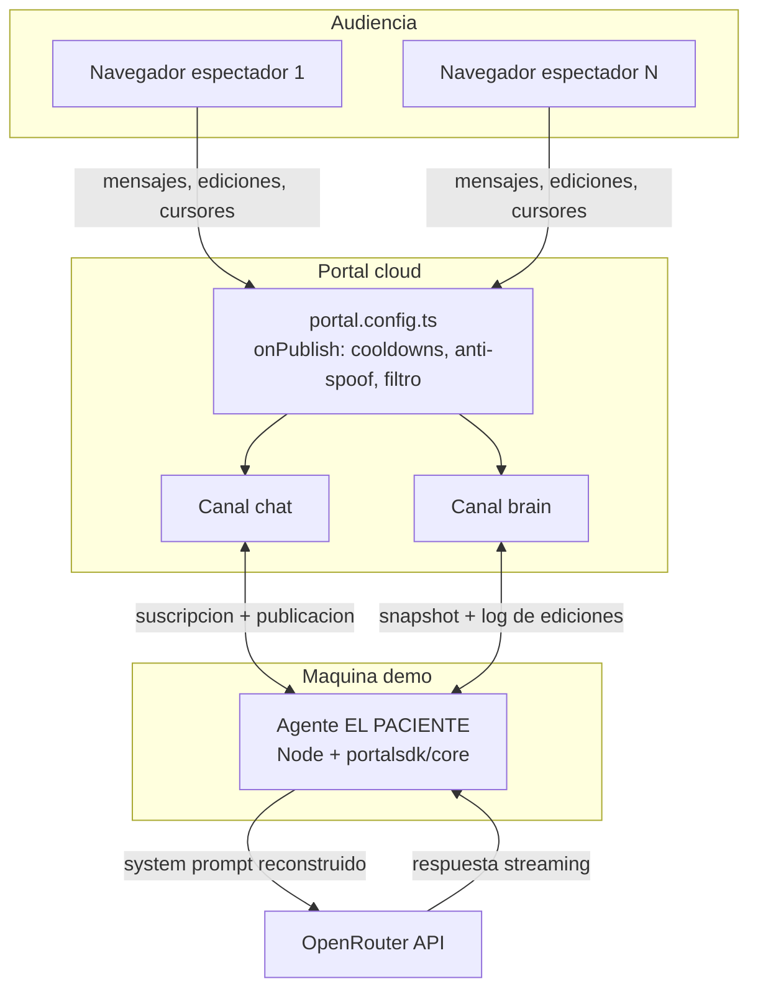

# Arquitectura técnica

Documento vivo. Actualizar cada vez que cambie el stack, la estructura de carpetas
o cualquier decisión técnica relevante. Los cambios se registran también en `changelog/`.

---

## Stack seleccionado

| Capa | Tecnología | Justificación |
|------|-----------|---------------|
| Frontend | React 19 + Vite + TypeScript | Portal publica bindings oficiales para React (`@portalsdk/react`); Vite es el camino más corto a una SPA |
| Realtime / estado | **Portal** (`@portalsdk/react`, `@portalsdk/core`, `portal.config.ts`) | Requisito del hackathon y encaja exacto: canales con historial, presencia, typing, mensajes ephemeral y middleware server-side |
| IA | **OpenRouter** (modelo por defecto: `anthropic/claude-haiku-4.5`) | Un endpoint, muchos modelos: rápido y con personalidad para sentirse "en directo"; cambiable por env sin tocar código |
| Agente | Proceso Node 22+ con `@portalsdk/core` | Portal no documenta API REST de publicación server-side → la IA se conecta como un cliente más, con identidad propia |
| Estilos | Tailwind CSS v4 | Velocidad; los tokens del design system se mapean a variables CSS |
| Base de datos | Ninguna | El estado ES los canales de Portal (historial incluido). Ver `data-model.md` |
| Despliegue | Vercel (frontend) + agente local en la máquina de la demo | Cero fricción de deploy en hackathon; el agente es un `pnpm agent` |

---

## Diagrama de componentes



Flujo clave: una edición del cerebro pasa por el middleware (¿cooldown ok? ¿usuario ok?),
se publica en `brain`, todos los clientes la ven al instante, y el agente — suscrito al
mismo canal — reconstruye su system prompt y decide si reacciona.

---

## Estructura de carpetas

Monorepo pnpm workspaces:

```
el-paciente/
├── apps/
│   ├── web/                → SPA React (Vite)
│   │   └── src/
│   │       ├── components/ → BrainSlot, EditLog, ChatStream, PresenceBar…
│   │       ├── hooks/      → useBrain (reduce historial → slots), useNickname…
│   │       └── lib/        → cliente Portal, utilidades
│   └── agent/              → Agente EL PACIENTE (Node + tsx)
│       └── src/
│           ├── brain.ts    → snapshot de slots + log desde el canal brain
│           ├── prompt.ts   → construcción del system prompt (capa fija + slots + log)
│           ├── llm.ts      → cliente OpenRouter (streaming)
│           └── index.ts    → bucle del agente: triggers, cola, publicación
├── packages/
│   └── shared/             → Tipos de mensajes y constantes (slots, cooldowns, canales)
├── portal.config.ts        → Config server-side de Portal (canales, middleware)
└── docs/ · changelog/ · mejoras/
```

---

## Estrategia de autenticación

**Todo el mundo es anónimo**, incluida la IA — no hay login (decisión de producto).

- Espectadores: modo anónimo de Portal (`me.anon === true`). El nickname y el color viajan
  como metadata de presencia y dentro del contenido de cada mensaje.
- **Anti-spoofing de la IA:** los mensajes con `role: "ai"` solo son válidos si llevan un
  campo `secret` que coincide con `env("AGENT_SECRET")`. El middleware `onPublish` de
  `portal.config.ts` los verifica: si el secreto no coincide → `block`; si coincide →
  `mask` con el mismo contenido sin el campo `secret` (así el secreto nunca llega a los
  clientes). Ningún navegador puede hacerse pasar por EL PACIENTE.
- Cooldowns por usuario usando `ctx.sender.id` (la credencial anónima persiste por cliente).

---

## Integraciones externas

- **Portal** — toda la capa realtime. Canales `chat` y `brain` (ver `data-model.md`).
  El middleware server-side vive en `portal.config.ts` y se despliega con la CLI de Portal.
- **OpenRouter** — inferencia del modelo. Solo el agente tiene la clave
  (`OPENROUTER_API_KEY`); el navegador jamás habla con OpenRouter. Modelo configurable
  con `OPENROUTER_MODEL` (por defecto `anthropic/claude-haiku-4.5`) y fallback
  `OPENROUTER_MODEL_FALLBACK`.

---

## MCPs del proyecto

Ninguno configurado a nivel de proyecto (`claude mcp list` → vacío, 2026-08-08).

| Servidor | Alcance | Para qué se usa | Variables necesarias |
|----------|---------|-----------------|----------------------|
| vercel | user (app de escritorio) | Deploy y logs del frontend | — (OAuth) |

Revisado el 2026-08-08: **Portal no publica servidor MCP oficial** (no aparece en
docs.useportal.co) y OpenRouter tampoco es necesario como MCP — el agente habla con su API
directamente. Si más adelante Portal publica uno, seguir el "Protocolo de MCPs" de
`CLAUDE.md` antes de instalarlo.

---

## Estrategia de despliegue

Repositorio: <https://github.com/polmarza/el-paciente> (público, `origin`, rama `main`).

- **Frontend:** Vercel, deploy desde `main` (`apps/web`). Variables `VITE_*` en el panel.
- **Config de Portal:** `portal.config.ts` se despliega con `@portalsdk/cli`. El CLI no
  tiene login interactivo: se autentica con la secret key del proyecto en el entorno.
  El deploy es atómico (si hay errores, no se aplica nada).

  ```bash
  export PORTAL_SECRET=sk_...        # secret key del proyecto (vive en .env.local)
  npx @portalsdk/cli deploy          # despliega portal.config.ts del directorio actual
  npx @portalsdk/cli secrets set AGENT_SECRET   # secretos que el middleware lee con env()
  ```

  Los secretos que usa el middleware (`AGENT_SECRET`) se registran con `secrets set`: su
  valor se resuelve en ejecución y nunca se escribe en la configuración.
- **Agente:** proceso local en la máquina de la demo (`pnpm agent`). Es deliberado: en un
  hackathon, un proceso que ves en tu terminal es más fiable que un worker remoto. Si se
  quisiera 24/7: Railway/Fly con el mismo código.
- Entornos: solo `dev` (local) y `demo` (Vercel + agente local). No hay staging.

---

## Decisiones técnicas relevantes

### 2026-08-08 — La IA es un cliente Portal, no un backend con API

**Contexto:** Portal no documenta publicación server-side vía REST; el SDK core es un
cliente WebSocket.
**Opciones:** (a) agente como cliente Portal en Node; (b) intentar publicar desde
middleware `onPublish`; (c) que el navegador del host ejecute la IA.
**Decisión:** (a). El middleware no está pensado para originar mensajes y (c) pone la
clave de OpenRouter en un navegador.
**Consecuencias:** el agente necesita un proceso corriendo durante la demo; la identidad
"IA" se protege con el patrón secret+mask en middleware.

### 2026-08-08 — Estado = canales de Portal, sin base de datos

**Contexto:** el cerebro necesita estado compartido con log de autoría.
**Decisión:** el canal `brain` es la fuente de verdad; el estado actual se deriva por
reducción (last-write-per-slot) y el historial del canal ES el log de ediciones que ve la IA.
**Consecuencias:** cero infra de datos; la persistencia depende de la retención de historial
de Portal (suficiente para una demo; el cerebro semilla se puede re-publicar con el reset).

### 2026-08-08 — Cooldowns en middleware, no en UI

**Contexto:** el caos es deseable pero debe ser gobernable; la UI es falsificable.
**Decisión:** `onPublish` en `portal.config.ts` rechaza ediciones que violen cooldown por
slot o por usuario (`block` con motivo legible que la UI muestra). La UI replica la cuenta
atrás solo como cortesía visual.
