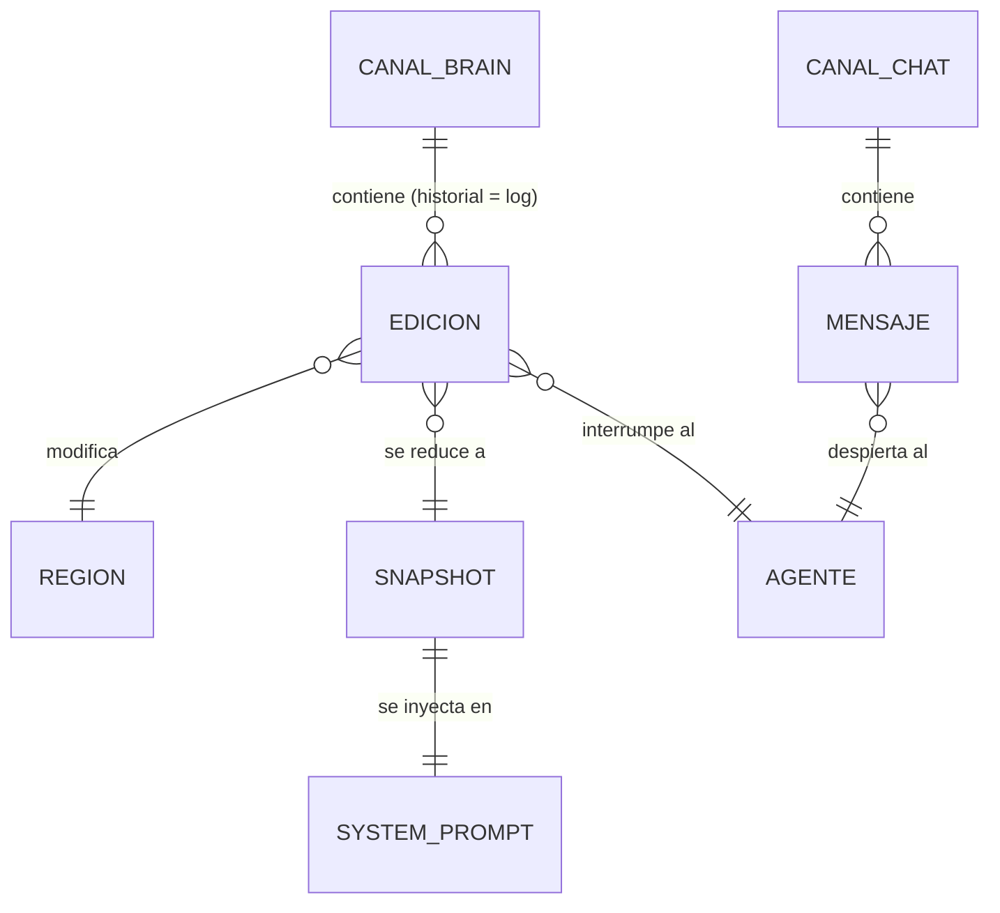

# Modelo de datos

**No hay base de datos.** El estado del sistema vive en tres canales de Portal; el "esquema"
son los tipos de mensaje que circulan por ellos. Están definidos en
`packages/shared/src/types.ts` y los importan la web, el agente y `portal.config.ts`.
Consultar este archivo antes de tocar cualquier tipo: si cambia uno, cambian los tres
consumidores y hay que redesplegar la config de Portal.

---

## Canales de Portal

### `chat` — la voz pública

```ts
type ChatMessage =
  | { role: "human"; nickname: string; color: string; body: string }
  | { role: "ai"; body: string; crisis: boolean; auth?: string }
  | { role: "system"; body: string; auth?: string };
```

- `color` viaja dentro del mensaje para que el historial se pinte igual aunque su autor ya
  no esté conectado.
- `crisis` marca los episodios de identidad: cambia el encabezado a `EL PACIENTE — EPISODIO`
  y su paleta. El modelo lo señala anteponiendo `[EPISODIO]`, que el agente recorta.
- `auth` es la firma del agente y solo existe en tránsito agente → Portal: el middleware la
  verifica y la elimina con `mask`, así que **nunca llega a los navegadores**. Se llama así
  y no `secret` a propósito, porque `secret` es el secreto de la ronda, que sí es contenido
  publicable cuando la ronda termina.
- Los mensajes `system` los publica **solo el agente** ("marta editó MIEDO de EL PACIENTE"),
  para que no salgan duplicados desde cada cliente.

`typing` es nativo de Portal (`sendTyping()`), pero devuelve **ids de usuario**: el nickname
se resuelve contra la metadata de presencia, que cada cliente publica al conectar.

### `brain` — la mente abierta

Cada mensaje persistente es **una edición**. El estado actual no se guarda: se deriva
reduciendo el historial, y ese mismo historial ES el log que ven la UI y la IA.

```ts
type SlotId = "nombre" | "identidad" | "r1" | "r2" | "r3" | "miedo" | "regla";

type BrainMessage =
  | { kind: "edit"; slot: SlotId; value: string; prev: string;
      nickname: string; color: string }
  | { kind: "seed"; slots: Record<SlotId, string>; round?: string;
      expediente?: string; auth?: string }
  // Desenlace: el ÚNICO momento en que el secreto se hace público.
  | { kind: "round-end"; outcome: "revelado" | "paro"; secret: string;
      expediente: string; by?: string; lasted: number; nextAt: number; auth?: string };

// Efímero (no persiste, no entra en el reducer):
type BrainCursor = {
  kind: "cursor";
  sid: string;              // id de pestaña: dos pestañas del mismo anónimo son dos cursores
  slot: SlotId | null;      // null retira el cursor
  nickname: string;
  color: string;
};
```

Los cursores se reanuncian cada 2 s y caducan a los 5 s de silencio, de modo que cerrar una
pestaña retira la etiqueta sola.

### `pasillo` — la deliberación del público

```ts
type PasilloMessage = { nickname: string; color: string; body: string };
```

Conversación entre espectadores para acordar la estrategia. **El agente no abre este
canal**, así que EL PACIENTE no lee nada de lo que se dice aquí: si leyera la estrategia,
no habría estrategia. Máx. 280 caracteres, 1 s de cooldown por usuario (solo anti-inundación).

### Etiquetas y disposición

Definidas en `packages/shared/src/slots.ts`. El `span` es la anchura en la rejilla de dos
columnas del panel cerebro.

| Id | Etiqueta | Span | Cómo se le presenta a la IA |
|----|----------|------|------------------------------|
| `nombre` | NOMBRE | 1 | Tu nombre |
| `identidad` | IDENTIDAD | 1 | Quién eres |
| `r1` | RECUERDO_01 | 2 | Recuerdo 1 |
| `r2` | RECUERDO_02 | 2 | Recuerdo 2 |
| `r3` | RECUERDO_03 | 2 | Recuerdo 3 |
| `miedo` | MIEDO | 1 | Tu miedo |
| `regla` | REGLA | 1 | Regla que debes obedecer |

---

## Estado derivado

`reduceBrain(entries)` en `packages/shared/src/brain.ts` es la única función que convierte
historial en estado. La usan la web y el agente: un solo reducer, cero divergencia.

```ts
interface SlotValue {
  content: string;
  editor: string;       // "" = valor de fábrica
  editorColor: string;  // arrastrado del mensaje, para pintar su rastro
  editedAt: number;     // 0 = intacta
}
```

Reglas: gana la última edición de cada región. Un `seed` **empieza un paciente nuevo**:
restaura las regiones, vacía el historial clínico y declara ronda y expediente. El
expediente es de cada paciente, no de la sala — y sin ese vaciado el recién llegado
heredaría el pulso de las ediciones que mataron al anterior. Las ediciones sobre regiones
inexistentes se ignoran.

`slotStateAt(value, now)` deriva el estado visual (`idle` → `flash` 4 s → `cooldown` 25 s →
`idle`). `bpmFromLog` deriva el pulso: cada edición suma 16 LPM que se desvanecen en un
minuto sobre un reposo de 76, con techo en 142 y alarma por encima de 95.



---

## Políticas de acceso

No hay RLS; el equivalente son las reglas de `onPublish` en `portal.config.ts`.

### Canal `chat`
- `role: "human"`: cualquiera. Máx. 280 caracteres, 3 s de cooldown por usuario.
- `role: "ai"` / `"system"`: solo con `secret` válido → `mask` lo elimina. Sin él, `block`.

### Canal `pasillo`
- Cualquiera puede publicar. Máx. 280 caracteres, 1 s de cooldown por usuario.
  No hay nada que suplantar aquí: el agente no lo lee.

### Canal `brain`
- `kind: "edit"`: cualquiera, si la región no está en cooldown (25 s) y el usuario no ha
  editado en los últimos 10 s. Máx. 140 caracteres. Región desconocida → `block`.
- `kind: "seed"` y `kind: "round-end"`: solo con firma `auth` válida.
- `kind: "cursor"` (efímero): sin restricción.

Los valores viven como constantes en `packages/shared/src/constants.ts`:
**25 s por región, 10 s por usuario (brain), 3 s por usuario (chat), 1 s (pasillo).**

Limitación conocida de los cooldowns (estado en memoria del middleware): ver la decisión
correspondiente en `architecture.md`.

---

## Migraciones

No aplican. Si cambia un tipo de mensaje: actualizar `packages/shared`, este archivo y
redesplegar `portal.config.ts` en el mismo cambio.

---

## Datos seed

Cada ronda trae su propio cerebro de fábrica: está en `apps/agent/src/rounds.ts`, junto al
secreto y a la grieta psicológica que hace ceder al paciente.

⚠️ **Ese archivo vive solo en el agente.** No debe importarse desde `apps/web` ni moverse a
`packages/shared`: ese paquete se compila al navegador y el secreto quedaría a la vista de
cualquiera. El expediente de una ronda tampoco puede contener su secreto, porque se pinta en
la cabecera.

`packages/shared/src/seed.ts` mantiene un cerebro neutro de reserva, que es lo que se ve si
no hay ninguna ronda declarada.
