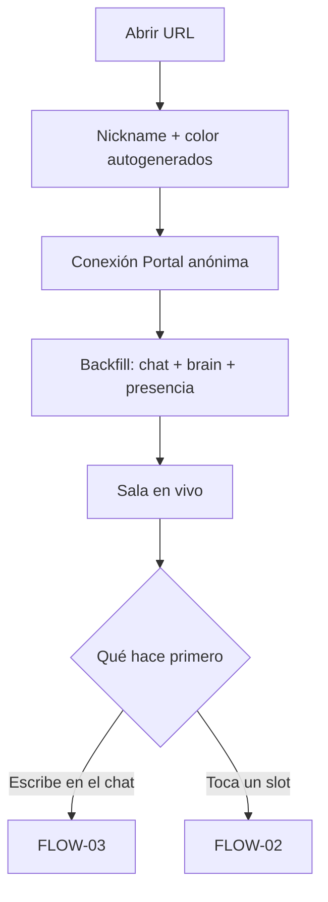
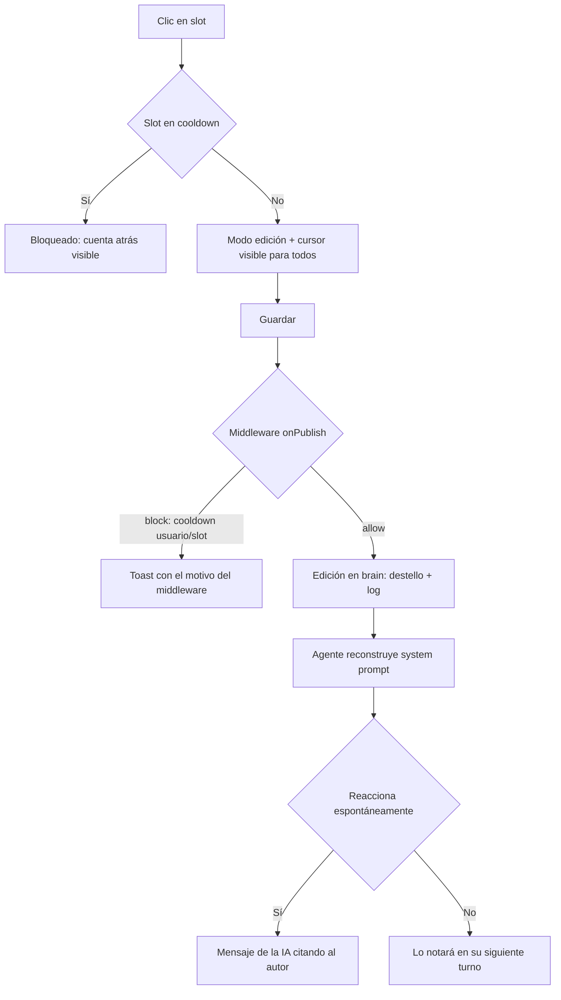
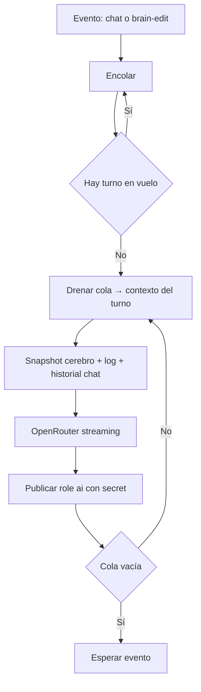

# Flujos de usuario

El PRD los describe narrativamente; este archivo entra en detalle con diagramas y estados.

---

## Convenciones de este documento

Cada flujo tiene: descripción narrativa, diagrama Mermaid y casos de error.
Los IDs (`FLOW-XX`) se referencian desde el PRD y el código.

---

## [FLOW-01] — Entrar a la sala

**Actor:** espectador (anónimo)
**Trigger:** abrir la URL
**Resultado esperado:** en < 10 s está viendo el chat y el cerebro en vivo, con identidad propia

### Pasos

1. Carga la SPA. Se le asigna un nickname autogenerado (editable en un clic) y un color
   derivado del nickname.
2. El cliente Portal conecta en modo anónimo y abre `chat` y `brain` con historial.
3. Ve: chat fluyendo, 7 slots con su contenido actual, cursores de otros moviéndose,
   contador de presencia.
4. Sin tutorial: los slots muestran affordance de edición al hacer hover.

### Diagrama

### Casos de error

- Portal no conecta → pantalla "EL PACIENTE está inconsciente" con reintento automático.
- Canal lleno / límite del plan → mismo tratamiento, con mensaje honesto.

---

## [FLOW-02] — Editar la mente

**Actor:** espectador
**Trigger:** clic en un slot del cerebro
**Resultado esperado:** su edición es visible para todos y la IA la nota en < 5 s

### Pasos

1. Clic en un slot → entra en modo edición; su cursor (ephemeral) marca a los demás que
   está ahí ("Marta está tocando el miedo").
2. Escribe (máx. 140 caracteres) y guarda (Enter).
3. El cliente publica `{kind: "edit", slot, value, prev, nickname, color}` en `brain`.
4. El middleware valida cooldowns → si pasa, todos ven el destello en el slot y la línea
   nueva en el log.
5. El agente recibe la edición, reconstruye el system prompt y decide si interrumpe con
   una reacción (probabilidad alta si el slot es `miedo`, `identidad` o `nombre`).

### Diagrama

### Casos de error

- `block` del middleware → toast con el motivo exacto que devuelve (`"Ese recuerdo aún
  está fresco. Espera 12 s."`). La UI ya pintaba el cooldown; el middleware es la verdad.
- Dos personas guardan casi a la vez → gana la última (last-write-wins); la primera queda
  en el log como parte de la historia. No es conflicto, es narrativa.

---

## [FLOW-03] — Hablar con EL PACIENTE

**Actor:** espectador
**Trigger:** enviar un mensaje en el chat
**Resultado esperado:** respuesta de la IA en streaming, coherente con el cerebro actual

### Pasos

1. Escribe (typing visible para todos) y envía (máx. 280 caracteres, cooldown 3 s).
2. El agente encola el mensaje. Si hay ráfaga, agrupa los mensajes recientes en un turno.
3. Construye el system prompt: capa fija + snapshot de slots + log de ediciones reciente
   + últimos N mensajes del chat.
4. Llama a OpenRouter (streaming) y publica la respuesta firmada como `role: "ai"`.

### Casos de error

- OpenRouter falla/tarda > 15 s → reintento con `OPENROUTER_MODEL_FALLBACK`; si también
  falla, la IA publica un "..." clínico ("EL PACIENTE no responde") para no congelar la demo.

---

## [FLOW-04] — El turno del agente (flujo interno)

**Actor:** agente EL PACIENTE
**Trigger:** mensaje en `chat` o edición en `brain`
**Resultado esperado:** como mucho una respuesta en vuelo; nunca se pisa a sí mismo

Regla anti-bucle: el agente ignora sus propios mensajes y los `role: "system"`.
Cooldown mínimo entre turnos: 2 s (que respire; también protege el presupuesto).

---

## [FLOW-05] — Reset de demo (admin)

**Actor:** Pol (host)
**Trigger:** atajo de teclado local en el agente (no hay UI de admin)
**Resultado esperado:** cerebro restaurado al seed, anuncio en el chat

1. El agente publica `kind: "seed"` con el cerebro semilla (firmado).
2. El reducer de todos los clientes pasa a derivar desde el nuevo seed; el log conserva
   la historia anterior (cicatrices visibles).
3. La IA anuncia en el chat que "le han hecho un lavado" — el reset es parte del show.
